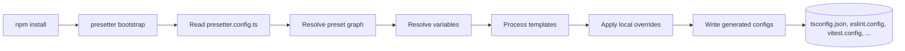
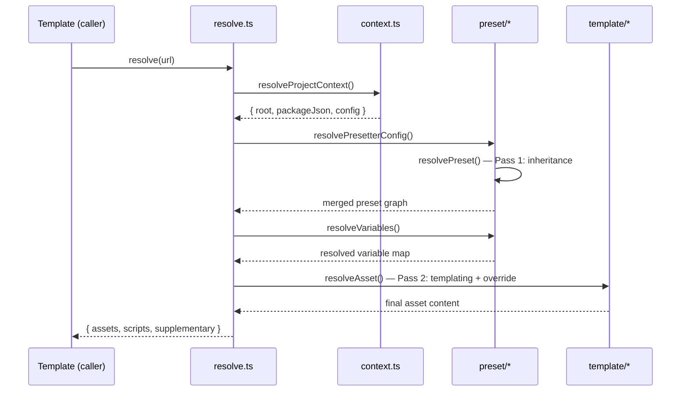
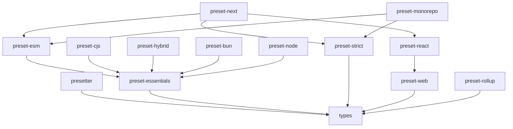
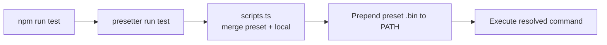

# 🏛️ Presetter Architecture

> A diagram-led tour of the Presetter engine, preset ecosystem, and monorepo topology. If you are new to the codebase, start here; if you are extending it, keep this open alongside `packages/presetter/src/`.

---

## 1. 🎯 Purpose & Scope

**Presetter** is split into two concerns that meet at bootstrap time:

- The **engine** (`packages/presetter`) is a template processor and script merger. It reads a project's `presetter.config.ts`, walks the `extends` graph of presets, resolves variables, processes templates, applies user overrides, and serialises the final assets to disk (`tsconfig.json`, ESLint config, Vitest config, `.gitignore`, etc.). It also composes `package.json` scripts and resolves preset-local binaries at runtime.
- **Presets** (`presets/*`) are pure content packages. They ship declarative `templates/`, `supplementary/`, `variables`, `scripts`, and optionally inherit from other presets. They are consumed by the engine; they never mutate the file system themselves.

This separation is the core architectural invariant: **engines process, presets declare**. Every feature below is a consequence of keeping that line clean.

---

## 2. 🗺️ Big-Picture Flow

What happens between `npm install` and a working dev environment:



Every arrow is a pure function in the engine: input comes from presets + user config, output is the next stage's input. The only side effect is the last step (`WR`).

---

## 3. 🧠 Two-Pass Resolution

The heart of the engine lives in `packages/presetter/src/resolve.ts`. Resolution is split into two passes so that inheritance can be computed independently of template substitution.



**How to read the passes:**

- **Pass 1 — inheritance.** `preset/resolvePreset` walks every `extends` edge depth-first, merging child preset content on top of parents. The output is a single flattened preset object; no `{variable}` tokens have been substituted yet.
- **Pass 2 — templating + override.** `template/substitute` replaces `{variable}` tokens in every asset using the resolved variable map, then `template/merge` applies any local `override` block from the caller. Templating runs *after* inheritance so parents can define variables and children (or the end user) can redefine them.
- **Pass 3 — serialisation (implicit).** The caller (typically `executable/entry.ts bootstrap`) takes the result of `resolve` and writes it to disk via `serialization.ts` + `io.ts`. The engine core never writes files itself.

---

## 4. 📂 Repository Layout

```
presetter/
├── packages/        ← engine + shared types (published to npm)
├── presets/         ← official preset content packages
├── website/         ← Docusaurus documentation site (alvis.github.io/presetter)
├── e2e/             ← end-to-end integration tests across real workspaces
├── examples/        ← minimal consumer projects used for manual sanity checks
└── assets/          ← logos, demo GIFs, before/after imagery for marketing
```

Everything shippable is in `packages/` and `presets/`. The other directories support development and documentation only.

---

## 5. 🎛️ Core Engine Modules

Files live under `packages/presetter/src/`. One-line gloss each:

| File | Responsibility |
| --- | --- |
| `index.ts` | Public entry point; re-exports the stable API surface. |
| `context.ts` | Locates project root and loads `package.json` + `presetter.config.ts`. |
| `resolve.ts` | Orchestrates the two-pass resolution pipeline. |
| `parsing.ts` | Parses and normalises preset definitions (YAML, JSON, JS). |
| `serialization.ts` | Serialises resolved assets back to the correct on-disk formats. |
| `io.ts` | Low-level file system helpers (read/write/diff). |
| `scripts.ts` | Merges preset scripts with local `package.json` scripts. |
| `run.ts` | `run` / `run-s` / `run-p` command runner; resolves preset `.bin` paths. |
| `task.ts` | Task graph and execution primitives used by `run.ts`. |
| `debugger.ts` | Shared `debug` namespace for engine tracing. |

**Subsystems** (each has its own directory):

- `executable/` — CLI entrypoints. `entry.ts` wires `yargs` to the resolver; `error.ts` formats user-facing diagnostics.
- `preset/` — Preset-side concerns. `bootstrap.ts` drives `presetter bootstrap`, `project.ts` handles project-level metadata, `scripts.ts` merges preset scripts, plus `config/` and `resolution/` submodules.
- `template/` — Template processing. `merge.ts` implements the override merge algorithm; `substitute.ts` does `{variable}` interpolation.
- `utilities/` — Shared helpers (`display.ts`, `mapping.ts`, `object.ts`).

---

## 6. 🧩 Preset Anatomy

Every preset is a tiny npm package with a fixed shape:

```mermaid
flowchart TB
  subgraph P["@presetter/preset-<name>"]
    PJ[package.json<br/>peer deps + metadata]
    SRC[src/<br/>preset definition]
    TPL[templates/<br/>config templates]
    OVR[supplementary/<br/>override fragments]
  end
  BASE[@presetter/preset-essentials]
  P -. extends .-> BASE
```

A preset's `src/index.ts` is typically just a `preset()` call:

```typescript
import { preset } from 'presetter';
import essentials from '@presetter/preset-essentials';

export default preset('node', {
  extends: [essentials],
  variables: { target: 'ES2023' },
  scripts: { /* preset-defined lifecycle scripts */ },
});
```

Nothing else is required — templates are discovered relative to the preset's package root.

---

## 7. 🌐 Package Dependency Graph

This is the authoritative dependency graph; other docs should link here rather than duplicate it.



**Edge legend:** `A --> B` means *A depends on B* (either as `peerDependency`, `dependency`, or as a `preset.extends` target). `preset-essentials` is the de facto base for runtime/module-system presets; `preset-next` is a composite that fans in from `esm`, `strict`, and `react`.

---

## 8. 🏃 Runtime Topology

When a consumer runs a script, the engine sits on the execution path:



- `preset/scripts.ts` flattens preset-level scripts and composes them with the consumer's `package.json` scripts.
- `run.ts` resolves the target command, walks each preset's `node_modules/.bin`, prepends those directories to `PATH`, and spawns the process via `execa`. This is what lets presets ship their own `vitest`/`eslint` without hoisting.

---

## 9. 🧪 Testing & 📦 Release Topology

- **Unit tests** live next to source under `spec/` folders in each package (Vitest). Co-location keeps tests within arm's reach of the code under test.
- **End-to-end tests** live in `e2e/` and exercise real bootstrap flows against fixture workspaces.
- **Changelog generation** is driven by [`cliff.yaml`](cliff.yaml) (git-cliff) at the repo root.
- **Releases are per-package and user-orchestrated.** There is no monorepo-wide release command. Contributors publish individual packages after their changes land on `master`; automation is intentionally out of scope at the repo level so that each package can move at its own cadence.

---

## 10. 🔌 Extension Points

The smallest custom preset is a single file:

```typescript
import { preset } from 'presetter';

export default preset('my-preset', {
  variables: { source: 'src', output: 'dist' },
  scripts: { build: 'tsc', test: 'vitest' },
  assets: {
    'tsconfig.json': {
      compilerOptions: { target: 'ES2022', module: 'ESNext' },
    },
  },
});
```

From there you can:

- Add a `templates/` directory and reference files by relative path to take advantage of `{variable}` substitution.
- Set `extends: [somePreset]` to inherit from an existing preset; your declarations win on merge.
- Publish the package under the `@presetter/preset-*` convention (or any scope — the engine only cares about the exported default).

For the full type surface of `preset()`, `PresetDefinition`, variables, and override maps, see **[packages/types](packages/types)**.
