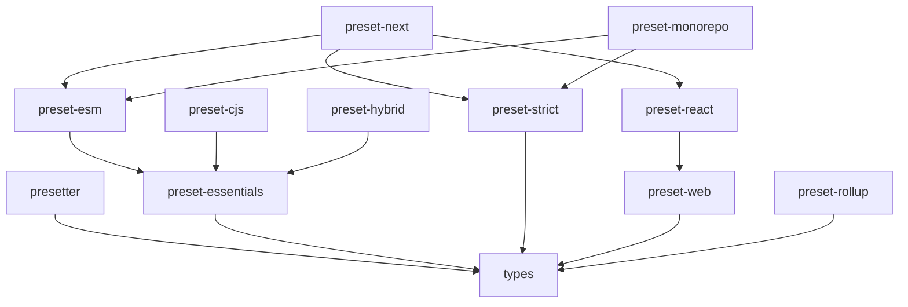

# 

<div align="center">

[](https://github.com/alvis/presetter/releases)
[](https://github.com/alvis/presetter/actions)
[](https://codeclimate.com/github/alvis/presetter/maintainability)
[](https://codeclimate.com/github/alvis/presetter/test_coverage)
[](https://libraries.io/npm/presetter)

_Transform 40+ dev dependencies into 2 packages — template-driven configuration management for modern TypeScript development_

•   [Quick Start](#-quick-start)   •   [Monorepo Structure](#-monorepo-structure)   •   [Official Presets](#-official-presets)   •   [Usage](#-usage)   •

</div>

**Presetter** is a configuration management tool that eliminates the pain of setting up and maintaining build configurations across TypeScript projects. Instead of copying dozens of config files and managing 40+ dev dependencies, you install 2 packages and get a perfectly configured development environment.

This monorepo contains the **Presetter engine** and a comprehensive ecosystem of **official presets** for every TypeScript development scenario.


---

## 🚀 Quick Start

### 🎯 Choose Your Development Style

```bash
# 🟢 Modern ESM development
npx presetter use presetter-preset-esm

# 🔗 Legacy CommonJS compatibility
npx presetter use presetter-preset-cjs

# 🌐 Dual-module library publishing
npx presetter use presetter-preset-hybrid

# 🎨 Modern web development (TailwindCSS + Storybook)
npx presetter use presetter-preset-esm presetter-preset-web

# ⚛️ React application with optimized toolchain
npx presetter use presetter-preset-esm presetter-preset-react

# 🏢 Production-grade (security + 100% coverage)
npx presetter use presetter-preset-esm presetter-preset-strict

# ⚡ Next.js application with full-stack support
npx presetter use presetter-preset-next
```

### 🔧 Or Set It Up Manually

1. **Add Presetter and preset to your project:**

```json5
{
  scripts: {
    bootstrap: 'presetter bootstrap',
  },
  devDependencies: {
    'presetter': 'latest',
    'presetter-preset-esm': 'latest',
  },
}
```

2. **Create preset configuration:**

```typescript
// presetter.config.ts
export { default } from 'presetter-preset-esm';
```

3. **Install and start developing:**

```bash
npm install  # Configurations generated automatically
npm run test # Everything just works! ✨
```


---

## 🏗️ Monorepo Structure

This repository is organized as a TypeScript monorepo containing the core Presetter engine and all official presets:

```
presetter/
├── packages/
│   ├── presetter/              🎛️ Core configuration management engine
│   ├── types/                  📋 TypeScript definitions for preset development
│   │
│   ├── preset-essentials/      🏗️ Foundation toolkit (TypeScript, ESLint, Vitest)
│   ├── preset-monorepo/        📦 Monorepo project management
│   │
│   ├── preset-esm/             🚀 ESM-first development
│   ├── preset-cjs/             🔗 CommonJS compatibility
│   ├── preset-hybrid/          🌐 Dual CommonJS/ESM packages
│   │
│   ├── preset-strict/          🏢 Production-grade quality enforcement
│   ├── preset-web/             🎨 Modern web development stack
│   ├── preset-react/           ⚛️ React development excellence
│   ├── preset-next/            ⚡ Next.js full-stack development
│   └── preset-rollup/          📦 Professional library bundling
│
└── assets/                     🎨 Logos, demos, and documentation assets
```

### 🎯 Package Categories

| **Category**       | **Packages**                                                   | **Purpose**                              |
| ------------------ | -------------------------------------------------------------- | ---------------------------------------- |
| **Core Engine**    | `presetter`, `types`                                           | Configuration management infrastructure  |
| **Foundation**     | `preset-essentials`, `preset-monorepo`                                | Base TypeScript development toolkit      |
| **Module Systems** | `preset-esm`, `preset-cjs`, `preset-hybrid`                           | JavaScript module format specializations |
| **Extensions**     | `preset-strict`, `preset-web`, `preset-react`, `preset-next`, `preset-rollup` | Specialized development environments     |

---

## 📦 Official Presets

### 🏗️ Foundation Presets

| Preset                                                        | Purpose                                 | Dependencies                                | Best For                               |
| ------------------------------------------------------------- | --------------------------------------- | ------------------------------------------- | -------------------------------------- |
| **[presetter-preset-essentials](packages/preset-essentials)** | Complete TypeScript development toolkit | TypeScript, ESLint, Vitest, Prettier, Husky | Foundation for all TypeScript projects |
| **[presetter-preset-monorepo](packages/preset-monorepo)**     | Monorepo project management             | Workspace tools, cross-package scripts      | Multi-package repositories             |

### 🚀 Module System Presets

| Preset                                                | Purpose                    | Extends    | Best For                                  |
| ----------------------------------------------------- | -------------------------- | ---------- | ----------------------------------------- |
| **[presetter-preset-esm](packages/preset-esm)**       | ESM-first development      | essentials | Modern Node.js projects, libraries        |
| **[presetter-preset-cjs](packages/preset-cjs)**       | CommonJS compatibility     | essentials | Legacy environments, enterprise           |
| **[presetter-preset-hybrid](packages/preset-hybrid)** | Dual CommonJS/ESM packages | essentials | npm libraries needing broad compatibility |

### 🎨 Specialized Extension Presets

| Preset                                                | Purpose                              | Extends         | Best For                                  |
| ----------------------------------------------------- | ------------------------------------ | --------------- | ----------------------------------------- |
| **[presetter-preset-strict](packages/preset-strict)** | Production-grade quality enforcement | Any base preset | Enterprise applications, critical systems |
| **[presetter-preset-web](packages/preset-web)**       | Modern web development stack         | Any base preset | Web applications, SPAs                    |
| **[presetter-preset-react](packages/preset-react)**   | React development excellence         | Any base preset | React applications, component libraries   |
| **[presetter-preset-next](packages/preset-next)**     | Next.js full-stack development       | esm + strict + react | Next.js apps with App Router, Server Components |
| **[presetter-preset-rollup](packages/preset-rollup)** | Professional library bundling        | Any base preset | npm packages, open-source libraries       |

### 🎯 Common Preset Combinations

```typescript
// Modern web application
extends: [esm, web]

// React component library
extends: [react, rollup]

// Legacy Node.js service
extends: [cjs]

// Full-stack TypeScript monorepo
extends: [monorepo]

// Next.js application (includes everything)
export { default } from 'presetter-preset-next';
```

---

## 🔍 How Presetter Works

**Presetter** transforms configuration management through intelligent template processing:

### 🎛️ The Core Engine ([packages/presetter](packages/presetter))

Presetter handles two main responsibilities:

1. **🏗️ Environment Setup:**

   - Installs development dependencies defined by presets
   - Generates configuration files using sophisticated templates

2. **⚡ Script Management:**
   - Merges preset scripts with local `package.json` scripts
   - Provides intelligent script composition and execution
   - Enables `run`, `run-s`, and `run-p` commands for enhanced workflows

### 📋 Preset Architecture

Each preset is a reusable configuration bundle containing:

- **Dependencies**: Defined as `peerDependencies` and installed automatically
- **Configuration Templates**: Dynamic files that adapt to your project structure
- **Scripts**: Lifecycle commands that integrate with your local workflows
- **Variables**: Customizable parameters for flexible configuration

### 🧠 Two-Pass Resolution System

Presetter uses a sophisticated resolution process:

1. **📋 Dependency Resolution**: Build preset inheritance tree and merge configurations
2. **🎯 Asset Generation**: Process templates with context-aware variable substitution
3. **⚡ Override Application**: Apply customizations while preserving preset benefits

---

## 🛠️ Usage

### 📝 Basic Configuration

```typescript
// presetter.config.ts - Use a preset as-is
export { default } from 'presetter-preset-esm';
```

### 🎨 Advanced Customization

```typescript
// presetter.config.ts - Customize and extend presets
import { preset } from 'presetter';
import esm from 'presetter-preset-esm';
import strict from 'presetter-preset-strict';

export default preset('my-project', {
  extends: [esm, strict],
  override: {
    variables: {
      target: 'ES2023', // Modern compilation target
      source: 'source', // Custom source directory
    },
    assets: {
      'tsconfig.json': {
        compilerOptions: {
          allowImportingTsExtensions: true,
        },
      },
    },
  },
});
```

### ⚡ CLI Commands

```bash
# Preset management
presetter use <preset>         # Adopt preset(s) to project
presetter bootstrap           # Apply configurations
presetter unset              # Remove all preset artifacts

# Development workflows
run build                    # Build your project
run test                     # Run tests with coverage
run lint                     # Lint and fix code
run watch                    # Development mode

# Advanced execution
run-s clean build test       # Sequential execution
run-p lint test              # Parallel execution
```

---

## 🏢 Monorepo Development

### 🔧 Development Setup

This monorepo uses **Presetter itself** for development! Each package has its own preset configuration:

```bash
# Install dependencies
npm install

# Bootstrap all packages
npm run bootstrap

# Run tests across all packages
npm run test

# Build all packages
npm run build
```

### 📊 Package Dependencies



### 🎯 Workspace Scripts

The monorepo provides convenient workspace-wide commands:

| Command             | Purpose                                |
| ------------------- | -------------------------------------- |
| `npm run build`     | Build all packages in dependency order |
| `npm run test`      | Run tests across all packages          |
| `npm run lint`      | Lint all packages with auto-fix        |
| `npm run clean`     | Clean build artifacts                  |
| `npm run bootstrap` | Bootstrap all preset configurations    |

---

## 📖 Documentation

### 📚 Package Documentation

Each package contains comprehensive documentation:

- **[Core Engine Documentation](packages/presetter)** - CLI usage, configuration, advanced features
- **[Preset Development Guide](packages/types)** - TypeScript definitions and preset creation
- **Individual Preset Guides** - Detailed feature explanations and usage examples

### 🎓 Learning Resources

| Topic               | Resource                                                  |
| ------------------- | --------------------------------------------------------- |
| **Getting Started** | [Core Engine Quick Start](packages/presetter#quick-start) |
| **Preset Creation** | [Types Package Guide](packages/types)                     |
| **Advanced Usage**  | [Configuration Customization](#-advanced-customization)   |
| **Monorepo Setup**  | [Monorepo Preset Guide](packages/preset-monorepo)         |

---

## 🤝 Contributing

We'd love your ideas and contributions!
Submit issues or suggestions via [GitHub Issues](https://github.com/alvis/presetter/issues).
See the [Contribution Guide](https://github.com/alvis/presetter/blob/master/CONTRIBUTING.md) for more details.

---

## ❓ FAQ

### How do I create a custom preset?

Create a TypeScript file that exports a preset configuration:

```typescript
import { preset } from 'presetter';

export default preset('my-preset', {
  variables: {
    source: 'src',
    output: 'dist',
  },
  scripts: {
    build: 'tsc',
    test: 'vitest',
  },
  assets: {
    'tsconfig.json': {
      compilerOptions: {
        target: 'ES2022',
        module: 'ESNext',
      },
    },
  },
});
```

### How do I customize an existing preset?

Use the `override` field to modify preset configurations:

```typescript
import { preset } from 'presetter';
import esm from 'presetter-preset-esm';

export default preset('custom', {
  extends: [esm],
  override: {
    assets: {
      'tsconfig.json': {
        compilerOptions: {
          strict: false, // Relax TypeScript strictness
        },
      },
    },
  },
});
```

### Can I combine multiple presets?

Yes! Presets are designed to be composable:

```typescript
import { preset } from 'presetter';
import essentials from 'presetter-preset-essentials';
import web from 'presetter-preset-web';
import react from 'presetter-preset-react';
import strict from 'presetter-preset-strict';

export default preset('ultimate-react', {
  extends: [essentials, web, react, strict],
});
```

### How do I ignore files from a preset?

Override the asset with `null`:

```typescript
export default preset('custom', {
  extends: [somePreset],
  override: {
    assets: {
      '.gitignore': null, // Don't generate .gitignore
    },
  },
});
```

---

## 🌟 Philosophy

Presetter was born from the frustration of maintaining identical configurations across multiple TypeScript projects. The core principles:

- **🎯 Simplicity**: One command should set up a complete development environment
- **🔄 Maintainability**: Updates should propagate automatically across all projects
- **🧩 Composability**: Presets should work together seamlessly
- **⚡ Flexibility**: Local customizations should always be respected
- **📈 Scalability**: Should work for individual projects and large monorepos

---

## 📄 License

Released under the [MIT License](https://github.com/alvis/presetter/blob/master/LICENSE).
© 2020, [Alvis Tang](https://github.com/alvis).

[](https://github.com/alvis/presetter/blob/master/LICENSE)
