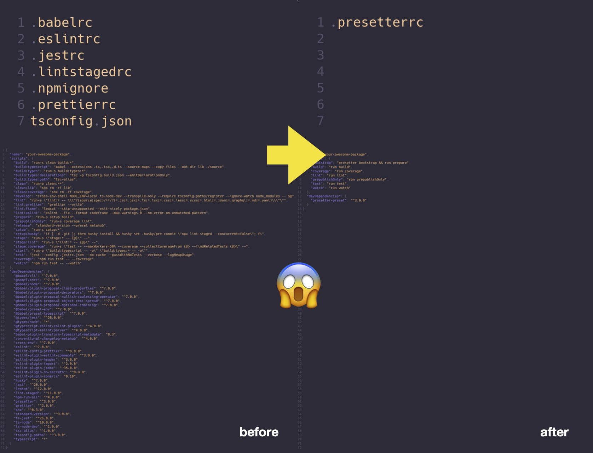

# 

<div align="center">

_Setup build settings from a template, quick and right!_

•   [Quick Start](#quick-start)   •   [Concept](#concept)   •   [Known Limitations](#known-limitations)   •   [FAQ](#faq)   •   [About](#about)   •

</div>

Sharing configurations for building tools across projects is painful. How many time you've copied configs for `babel`, `eslint`, `jest`, `typescript` or the life cycle scripts in `package.json`?
How many dev dependencies you have to install before you can kick start a project?

What's more, what if you want to update configs for all projects? :man_facepalming:

**Presetter is a utility for setting up building tools for your project from a template.** This means with just only two dev packages, namely this package and your favorite template preset, all essential development packages, such as typescript, eslint and jest, together with their configuration files provided by the preset, are automatically setup for you upon the project's initialization.



## Quick Start

1. Bootstrap your project with a preset (e.g. [presetter-preset-essentials](packages/preset-essentials))

```shell
npx presetter use <preset package name>
```

That's. One command and you're set.

2. Develop and run life cycle scripts provided by the preset

At this point, all development packages specified in the preset are installed,
and now you can try to run some example life cycle scripts provided by the preset (e.g. try `npx run test`).


## Concept

The concept comprises two part: [**presetter**](packages/presetter) (this package) and a **preset**, which you can easily [create one for your own requirement](#how-to-create-a-preset).

### presetter

Presetter is a utility for two tasks:

1. setting up a development environment for a project by
   - installing development dependencies specified in the preset without polluting package.json
   - symlinking configuration files (e.g. `.babelrc`) from the preset module to the project root
2. merging life-cycle scripts from the template and the local version in package.json

[SEE HERE FOR THE CLI USAGE](packages/presetter#usage)

#### Life-Cycle Scripts

When you run `presetter run <task>` (or its alias `run <task>`), presetter will perform the following:

1. Combine the local scripts and those provided by the preset
2. Backup `package.json` as `~package.json` 
3. Place the combined script into a temporary `package.json` 
4. Run the task via `npm run <task>` as usual
5. Restore the original `package.json` after running the task

_PROTIPS_:
Local scripts always have a higher priority than the template scripts.
So you can always customize the life cycle script by putting your own version into `package.json`.

Upon running a life-cycle script involving the `run <task>` command in `package.json`, presetter will automatically resolve the task according to the template, so that you can always use the conventional `npm run <task>` as usual.

For example, with the following template and local `package.json`,
presetter will generate a `package.json` with the content below before running the script.

**Template**
```json
{
  "scripts": {
    "build": "tsc",
    "prepare": "npm run lint && npm run build",
    "lint": "eslint **/*.ts",
    "test": "jest"
  }
}
```

**Local package.json**
```json
{
  "scripts": {
    "build": "run build",
    "lint": "eslint --fix **/*.ts",
    "coverage": "run test -- --coverage"
  }
}
```

**Output**
```json
{
  "scripts": {
    "build": "tsc",
    "prepare": "npm run lint && npm run build",
    "lint": "eslint --fix **/*.ts",
    "test": "jest",
    "coverage": "jest --coverage"
  }
}
```

### preset

A preset is a collection of configuration to be shared.
An example can be found in [presetter-preset-essentials](/packages/preset-essentials) which is also used for developing presetter and [other demo presets below](#demo-presets).

A preset contains three parts:

1. A set of development packages declared as `peerDependencies` in the `package.json`:
   For a project adopting a preset, during its installation these packages will be installed by presetter automatically without making changes to the project's package.json.
2. A set of configuration files:
   These configuration files are to be symlinked to the adopting project's root.
3. A set of life cycle script template:
   These scripts provide the base where the `presetter run` command will use for merging.

For 1, the set of development packages to be installed is exported via `package.json`.
For 2 & 3, the configuration is exported via the default function in the preset package ([example](/packages/preset-essentials/source/index.ts)).

#### Config Extension

To overwrite part of the preset configuration (e.g. add a rule to the eslint config file template),
you can specify the new configuration under the `config` parameter in the configuration file (`.presetterrc` or `.presetterrc.json`).

During installation and life cycle script execution,
the content of this parameter will be passed to the configurator function provided by the preset package.
With this parameter, the preset can dynamically export customized config files and life cycle scripts.
You can [checkout the example preset to see how it work](/packages/preset-essentials/source/index.ts).

## Known Limitations

#### Missing dependent development packages after `npm install <package>`

In npm v5 & v6, any subsequent `npm install <package>` command will cause the installed development packages to be removed after installation.
This is due to a side effect of the introduction of `package-lock.json` in npm v5,
where the npm dedupe process begins to remove any packages not recorded in `package-lock.json` after package installation.

Since the development packages are only declared as peer dependencies in the preset package, it's not recorded in `package-lock.json` and therefore the problem.

Currently, there are two solutions

1. Run `presetter bootstrap` manually after each additional package installation.
   This will make sure any missing dependencies will be installed again.
2. Use `yarn` to install additional packages as it won't remove any packages during the process.

This problem, fortunately, ~~should soon~~ has now become a history when [npm v7](https://blog.npmjs.org/post/186983646370/npm-cli-roadmap-summer-2019) was released.
The [auto peer dependencies installation](https://github.blog/2020-10-13-presenting-v7-0-0-of-the-npm-cli/) feature will now resolve this issue for good.

## FAQ

#### Life cycle scripts are broken 

It may be the case when a life cycle script crashed, resulting in `package.json` not be restored to its original version.
To fix the issue, you can simply replace the temporary `package.json` by its original at `~package.json`.

#### How to create a preset?

It's actually rather simple. You just need to prepare an ordinary npm package with a default export with signature `(args: PresetContext) => PresetAsset | Promise<PresetAsset>`, where
```ts
/** input for a preset configurator */
export interface PresetContext {
  /** information about the targeted project */
  target: {
    /** the package name defined in the targeted project's package.json */
    name: string;
    /** the root folder containing the targeted project's .presetterrc.json */
    root: string;
    /** normalized package.json from the targeted project's package.json */
    package: PackageJson;
  };
  /** content of .presetterrc */
  custom: PresetterConfig;
}

/** expected return from the configuration function from the preset */
export interface PresetAsset {
  /** list of presets to extend from */
  extends?: string[];
  /** mapping of files to be generated to its configuration template files (key: file path relative to the target project's root, value: template path) */
  template?: TemplateMap | TemplateMapGenerator;
  /** list of templates that should not be created as symlinks */
  noSymlinks?: string[] | Generator<string[]>;
  /** path to the scripts template */
  scripts?: string;
  /** variables to be substituted in templates */
  variable?: Record<string, string>;
  /** supplementary configuration applied to .presetterrc for enriching other presets */
  supplementaryConfig?: ConfigMap | ConfigMapGenerator;
}

/** an auxiliary type for representing a file path */
type Path = string;
/** an auxiliary type for representing a template (either path to the template file or its content) */
export type Template = string | Record<string, unknown>;
/** an auxiliary type for representing a dynamic template generator */
export type TemplateGenerator = Generator<Template>;
/** an auxiliary type for representing a collection of template (key: output path, value: template definition) */
export type TemplateMap = Record<string, Path | Template | TemplateGenerator>;
/** an auxiliary type for representing a dynamic template map generator */
export type TemplateMapGenerator = Generator<TemplateMap>;
/** an auxiliary type for representing a config */
export type Config = string[] | Record<string, unknown>;
/** an auxiliary type for representing a dynamic config generator */
export type ConfigGenerator = Generator<Config>;
/** an auxiliary type for representing a config map */
export type ConfigMap = Record<string, Path | Config | ConfigGenerator>;
/** an auxiliary type for representing a dynamic config map generator */
export type ConfigMapGenerator = Generator<ConfigMap>;
```

This function is a manifest generator which will be used to inform presetter what and how use the template files. For bundling other dev tools, you only need to declare them in `peerDependencies` in the `package.json` of the preset package. Presetter will pick them up and automatically install them on your target project.

## Demo Presets

There are many ways to create a preset. Checkout our example presets to learn more:

| Preset                                                         | Description                                                                                                                                                                                                    |
|----------------------------------------------------------------|----------------------------------------------------------------------------------------------------------------------------------------------------------------------------------------------------------------|
| [presetter-preset-esm](/packages/preset-esm)                   | An extension of `presetter-preset-essentials` but loaded with tools to help you to develop an ESM application with ease.                                                                                       |
| [presetter-preset-essentials](/packages/preset-essentials)     | A starter preset with lots of useful dev tools (e.g. eslint, jest etc.) bundled and configuration following the best practices.                                                                                |
| [presetter-preset-hybrid](/packages/preset-hybrid)             | Another extension of `presetter-preset-essentials` aiming to help you to create a dual CommonJS/ESM package without all the pains.                                                                             |
| [presetter-preset-react](/packages/preset-react)               | Want to control the output path of the generated files? or which template to use based on the context? `presetter-preset-react` is an example showing you how to generate your manifest programmatically.      |
| [presetter-preset-rollup](/packages/preset-rollup)             | An advanced preset showing you how to generate a content based on consolidated configs.                                                                                                                        |
| [presetter-preset-strict](/packages/preset-strict)             | Want to build a preset on top of an existing one? Check this out, it extends `presetter-preset-essentials` with extra rules.                                                                                   |
| [presetter-preset-web](/packages/preset-web)                   | Just want a preset with tools bundled? This one has only GraphQL, PostCSS and TailwindCSS bundled, with nothing extra.                                                                                         |
| [@alvis/preset-gatsby](https://github.com/alvis/preset-gatsby) | How to make a preset without publishing it? Check out my personal preset. For my case, I can just use `presetter use https://github.com/alvis/preset-gatsby` to setup my dev environment for a Gatsby project. |

## About

This project originated from my personal pain on maintaining a number of projects with fairly similar structure, having exactly the same build and test procedures, same `.babelrc`, `tsconfig.json` etc.
Every time when I setup a new project, I have to copy many **identical config files** such as `.babelrc`, `.eslintrc`, `.jestrc`, `.lintstagedrc`, `.npmignore`, `tsconfig.json` to name a few,
together with the following **40** 😱 development dependencies!!!

1. @babel/cli
1. @babel/core
1. @babel/node
1. @babel/plugin-proposal-class-properties
1. @babel/plugin-proposal-decorators
1. @babel/plugin-proposal-nullish-coalescing-operator
1. @babel/plugin-proposal-object-rest-spread
1. @babel/plugin-proposal-optional-chaining
1. @babel/preset-env
1. @babel/preset-typescript
1. @types/jest
1. @types/node
1. @typescript-eslint/eslint-plugin
1. @typescript-eslint/parser
1. babel-plugin-transform-typescript-metadata
1. conventional-changelog-metahub
1. cross-env
1. eslint
1. eslint-config-prettier
1. eslint-plugin-eslint-comments
1. eslint-plugin-header
1. eslint-plugin-import
1. eslint-plugin-jsdoc
1. eslint-plugin-no-secrets
1. eslint-plugin-sonarjs
1. husky
1. jest
1. leasot
1. lint-staged
1. npm-run-all
1. presetter
1. prettier
1. shx
1. standard-version
1. ts-jest
1. ts-node
1. ts-node-dev
1. tsc-alias
1. tsconfig-paths
1. typescript

So, I imagine, if it is possible to reduce all these 40 packages into 1?
I tried to look for a solution but no luck.
Therefore, I make this tool and make it available to everyone who has a similar problem as me.

### Philosophy

Every design has a design philosophy and here are those for presetter:
- Presetter should do one and only one job, which is providing building tools for the adopting project.
- A preset should be made flexible enough to adapt to different project need while maintaining the reusability.
- For the adopting project, updating only the preset version should be the only thing you need to do for updating the build dev dependencies and configuration files.
- Any changes to the local config should be preserved, even during a preset update.

### Related Projects

Let me know if you find any similar projects.
It would be nice to be included here.

### Contributing

Any new ideas? or got a bug? We definitely would love to have your contribution!

If you have any suggestion or issue, feel free to let the community know via [issues](../../issues).

Further, read the [contribution guide](CONTRIBUTING.md) for the detail of the code structure and useful commands etc.

### License

Copyright © 2020, [Alvis Tang](https://github.com/alvis). Released under the [MIT License](LICENSE).

[](https://github.com/alvis/presetter/blob/master/LICENSE)
