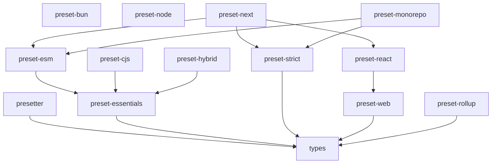

<p align="center">
  
</p>

<div align="center">

[](https://github.com/alvis/presetter/releases)
[](https://github.com/alvis/presetter/actions)
[](https://libraries.io/npm/presetter)
[](https://presetter.dev/docs/)

_Template-driven configuration management for TypeScript projects and monorepos_

•   [Quick Start](#-quick-start)   •   [Monorepo Structure](#-monorepo-structure)   •   [Official Presets](#-official-presets)   •   [Usage](#-usage)   •

</div>

**Presetter** helps maintainers ship shared TypeScript toolchain configuration across many repos and monorepo packages. Instead of hand-copying ESLint, Vitest, TypeScript, build, and script setup into every project, you describe the stack in `presetter.config.ts`, compose official presets, and regenerate the output files your toolchain expects.

This monorepo contains the **Presetter engine** and a comprehensive ecosystem of **official presets** for every TypeScript development scenario.

---

## ⚡ The Development Setup Revolution

### Still copying configs between projects? 😤

Every repo starts clean. Then the same `eslint`, `vitest`, `typescript`, build, and lifecycle settings fork in small ways across apps, packages, services, and CLIs.

Presetter moves that intent into `presetter.config.ts`: compose official presets for the shared baseline, keep local overrides visible, and regenerate the config files your toolchain still expects.

<p align="center">
  <video src="https://github.com/user-attachments/assets/d7141b4c-e7b3-4c2f-bb4e-995c209c3efd" controls playsinline preload="metadata" width="100%" title="Presetter launch video: make configuration maintainable again">
    <a href="https://github.com/user-attachments/assets/d7141b4c-e7b3-4c2f-bb4e-995c209c3efd">Watch the Presetter launch video</a>
  </video>
</p>

### The config drift loop vs. Presetter

```diff
# Before: copied config across repos and packages
workspace/
├── apps/web/eslint.config.ts       ← React-specific edits
├── apps/api/eslint.config.ts       ← Similar, but not quite the same
├── packages/ui/vitest.config.ts    ← Local test tweaks
├── packages/core/tsconfig.json     ← Shared intent copied by hand
└── packages/runtime/package.json   ← Scripts slowly drift

# After: explicit preset stack plus generated outputs
workspace/
+├── presetter.config.ts            ← Compose the maintained baseline
├── package.json                    ← Scripts merge with preset scripts
└── generated config files          ← Output files can stay out of Git
```

---

## 🚀 Quick Start

### 🎯 Choose Your Development Style

```bash
# 🟢 Modern ESM development
npm install --save-dev presetter @presetter/preset-esm

# 🔗 Legacy CommonJS compatibility
npm install --save-dev presetter @presetter/preset-cjs

# 🌐 Dual-module library publishing
npm install --save-dev presetter @presetter/preset-hybrid

# 🟩 Node.js runtime
npm install --save-dev presetter @presetter/preset-esm @presetter/preset-node

# 🥟 Bun runtime
npm install --save-dev presetter @presetter/preset-bun

# 🎨 Modern web development (TailwindCSS)
npm install --save-dev presetter @presetter/preset-esm @presetter/preset-web

# 📚 Storybook for Next.js development
npm install --save-dev presetter @presetter/preset-next @presetter/preset-storybook

# ⚛️ React application with optimized toolchain
npm install --save-dev presetter @presetter/preset-esm @presetter/preset-react

# 🏢 Production-grade (security + 100% coverage)
npm install --save-dev presetter @presetter/preset-esm @presetter/preset-strict

# ⚡ Next.js application with full-stack support
npm install --save-dev presetter @presetter/preset-next
```

### 🔧 Or Set It Up Manually

1. **Add Presetter and preset to your project:**

```json5
{
  scripts: {
    bootstrap: 'presetter bootstrap',
  },
  devDependencies: {
    'presetter': 'latest',
    '@presetter/preset-esm': 'latest',
  },
}
```

1. **Create preset configuration:**

```typescript
// presetter.config.ts
export { default } from '@presetter/preset-esm';
```

1. **Install and start developing:**

```bash
npm install
npm run bootstrap # Generate project configs from your preset stack
npm run test      # Run through the maintained toolchain
```


---

## 🏗️ Monorepo Structure

This repository is organized as a TypeScript monorepo containing the core Presetter engine and all official presets:

```
presetter/
├── packages/
│   ├── presetter/          🎛️ Core engine
│   └── types/              📋 TypeScript definitions
│
├── presets/
│   ├── essentials/         🏗️ Foundation toolkit
│   ├── monorepo/           📦 Monorepo management
│   │
│   ├── esm/                🚀 ESM-first
│   ├── cjs/                🔗 CommonJS
│   ├── hybrid/             🌐 Dual CJS/ESM
│   ├── bun/                🥟 Bun runtime
│   ├── node/               🟩 Node.js runtime
│   │
│   ├── strict/             🏢 Production-grade quality
│   ├── web/                🎨 Web dev stack
│   ├── storybook/          📚 Storybook
│   ├── react/              ⚛️ React
│   ├── next/               ⚡ Next.js
│   └── rollup/             📦 Library bundling
│
├── website/                📖 Docusaurus documentation site
├── e2e/                    🧪 End-to-end integration tests
├── examples/               🔬 Example consumer projects
└── assets/                 🎨 Logos and demo assets
```

### 🎯 Package Categories

| **Category**       | **Packages**                                                                                                                              | **Purpose**                                    |
| ------------------ | ----------------------------------------------------------------------------------------------------------------------------------------- | ---------------------------------------------- |
| **Core Engine**    | `presetter`, `@presetter/types`                                                                                                           | Configuration management infrastructure        |
| **Foundation**     | `@presetter/preset-essentials`, `@presetter/preset-monorepo`                                                                              | Base TypeScript development toolkit            |
| **Module Systems** | `@presetter/preset-esm`, `@presetter/preset-cjs`, `@presetter/preset-hybrid`                                                              | JavaScript module format specializations       |
| **Runtimes**       | `@presetter/preset-node`, `@presetter/preset-bun`                                                                                         | Runtime-specific TypeScript and build settings |
| **Extensions**     | `@presetter/preset-strict`, `@presetter/preset-web`, `@presetter/preset-storybook`, `@presetter/preset-react`, `@presetter/preset-rollup` | Specialized development environments           |
| **Frameworks**     | `@presetter/preset-next`                                                                                                                  | Framework-specific preset composition          |

---

## 📦 Official Presets

### 🏗️ Foundation Presets

| Preset                                                 | Purpose                                 | Dependencies                                | Best For                               |
| ------------------------------------------------------ | --------------------------------------- | ------------------------------------------- | -------------------------------------- |
| **[@presetter/preset-essentials](presets/essentials)** | Complete TypeScript development toolkit | TypeScript, ESLint, Vitest, Prettier, Husky | Foundation for all TypeScript projects |
| **[@presetter/preset-monorepo](presets/monorepo)**     | Monorepo project management             | Workspace tools, cross-package scripts      | Multi-package repositories             |

### 🚀 Module System & Runtime Presets

| Preset                                         | Purpose                    | Extends    | Best For                                  |
| ---------------------------------------------- | -------------------------- | ---------- | ----------------------------------------- |
| **[@presetter/preset-esm](presets/esm)**       | ESM-first development      | essentials | Modern Node.js projects, libraries        |
| **[@presetter/preset-cjs](presets/cjs)**       | CommonJS compatibility     | essentials | Legacy environments, enterprise           |
| **[@presetter/preset-hybrid](presets/hybrid)** | Dual CommonJS/ESM packages | essentials | npm libraries needing broad compatibility |
| **[@presetter/preset-bun](presets/bun)**       | Bun runtime and build flow | none       | Bun applications, CLIs, services          |
| **[@presetter/preset-node](presets/node)**     | Node.js runtime types      | none       | Node.js apps, CLIs, services              |

### 🎨 Specialized Extension Presets

| Preset                                               | Purpose                              | Extends                           | Best For                                        |
| ---------------------------------------------------- | ------------------------------------ | --------------------------------- | ----------------------------------------------- |
| **[@presetter/preset-strict](presets/strict)**       | Production-grade quality enforcement | Any base preset                   | Enterprise applications, critical systems       |
| **[@presetter/preset-web](presets/web)**             | Browser globals and Tailwind linting | Any base preset                   | Web applications, SPAs                          |
| **[@presetter/preset-storybook](presets/storybook)** | Storybook component workflow         | Any UI preset                     | Component development and interaction tests     |
| **[@presetter/preset-react](presets/react)**         | React and TSX tooling                | none                              | React applications, component libraries         |
| **[@presetter/preset-next](presets/next)**           | Next.js full-stack development       | esm + node + strict + web + react | Next.js apps with App Router, Server Components |
| **[@presetter/preset-rollup](presets/rollup)**       | Professional library bundling        | none                              | npm packages, open-source libraries             |

### 🎯 Common Preset Combinations

```typescript
// Modern web application
extends: [esm, web]

// Next.js with Storybook
extends: [next, storybook]

// Bun application
extends: [esm, bun]

// Node.js service
extends: [esm, node]

// React component library
extends: [react, rollup]

// Legacy Node.js service
extends: [cjs]

// Full-stack TypeScript monorepo
extends: [monorepo]

// Next.js application (includes everything)
export { default } from '@presetter/preset-next';
```

---

## 🔍 How Presetter Works

**Presetter** transforms configuration management through intelligent template processing:

### 🎛️ The Core Engine ([packages/presetter](packages/presetter))

Presetter handles two main responsibilities:

1. **🏗️ Environment Setup:**
   - Resolves the configured preset graph
   - Generates configuration files using sophisticated templates
   - Relies on package managers to install preset peer dependencies

2. **⚡ Script Management:**
   - Merges preset scripts with local `package.json` scripts
   - Provides intelligent script composition and execution
   - Enables `run`, `run-s`, and `run-p` commands for enhanced workflows
   - **Binary Path Resolution**: Discovers executables in each preset's `node_modules/.bin` and prepends them to PATH, allowing preset tools to take priority without requiring `shamefullyHoist` or `public-hoist-pattern` configuration

   > **Note**: Libraries loaded via dynamic import (like `@vitest/coverage-v8`) may still need to be installed at root or hoisted. See the [presetter package docs](packages/presetter) for details.

### 📋 Preset Architecture

Each preset is a reusable configuration bundle containing:

- **Dependencies**: Defined as `peerDependencies` and installed during bootstrap
- **Configuration Templates**: Dynamic files that adapt to your project structure
- **Scripts**: Lifecycle commands that integrate with your local workflows
- **Variables**: Customizable parameters for flexible configuration

### 🧠 Two-Pass Resolution System

Presetter uses a sophisticated resolution process:

1. **📋 Dependency Resolution**: Build preset inheritance tree and merge configurations
2. **🎯 Asset Generation**: Process templates with context-aware variable substitution
3. **⚡ Override Application**: Apply customizations while preserving preset benefits

> Want the full diagrammed walkthrough? See **[ARCHITECTURE.md](ARCHITECTURE.md)**.

---

## 🛠️ Usage

### 📝 Basic Configuration

```typescript
// presetter.config.ts - Use a preset as-is
export { default } from '@presetter/preset-esm';
```

### 🎨 Advanced Customization

```typescript
// presetter.config.ts - Customize and extend presets
import { preset } from 'presetter';
import esm from '@presetter/preset-esm';
import strict from '@presetter/preset-strict';

export default preset('my-project', {
  extends: [esm, strict],
  override: {
    variables: {
      target: 'ES2023', // Modern compilation target
      source: 'source', // Custom source directory
    },
    assets: {
      'tsconfig.json': {
        compilerOptions: {
          allowImportingTsExtensions: true,
        },
      },
    },
  },
});
```

### ⚡ CLI Commands

```bash
# Configuration generation
presetter bootstrap                         # Apply configurations
presetter bootstrap --projects "packages/*" # Bootstrap project path globs
presetter bootstrap --packages "@scope/*"   # Bootstrap package-name globs

# Development workflows
run build                    # Build your project
run test                     # Run tests with coverage
run lint                     # Lint and fix code
run watch                    # Development mode

# Advanced execution
run-s clean build test       # Sequential execution
run-p lint test              # Parallel execution
```

---

## 🏢 Monorepo Development

### 🔧 Development Setup

This monorepo uses **Presetter itself** for development! Each package has its own preset configuration:

```bash
# Install dependencies
npm install

# Bootstrap all packages
npm run bootstrap

# Run tests across all packages
npm run test

# Build all packages
npm run build
```

### 📊 Package Dependencies


```mermaid
graph TD
  T[types]
  P[presetter]
  E[preset-essentials]
  S[preset-strict]
  M[preset-esm]
  C[preset-cjs]
  H[preset-hybrid]
  B[preset-bun]
  N[preset-node]
  W[preset-web]
  R[preset-react]
  X[preset-next]
  U[preset-rollup]
  O[preset-monorepo]

  P --> T
  E --> T
  M --> E
  C --> E
  H --> E
  S --> T
  W --> T
  R --> W
  X --> M
  X --> S
  X --> R
  U --> T
  O --> M
  O --> S
```

### 🎯 Workspace Scripts

The monorepo provides convenient workspace-wide commands:

| Command             | Purpose                                |
| ------------------- | -------------------------------------- |
| `npm run build`     | Build all packages in dependency order |
| `npm run test`      | Run tests across all packages          |
| `npm run lint`      | Lint all packages with auto-fix        |
| `npm run clean`     | Clean build artifacts                  |
| `npm run bootstrap` | Bootstrap all preset configurations    |

---

## 📖 Documentation

### 📚 Package Documentation

Each package contains comprehensive documentation:

- **[Core Engine Documentation](packages/presetter)** - CLI usage, configuration, advanced features
- **[Preset Development Guide](packages/types)** - TypeScript definitions and preset creation
- **Individual Preset Guides** - Detailed feature explanations and usage examples

### 🎓 Learning Resources

| Topic               | Resource                                                  |
| ------------------- | --------------------------------------------------------- |
| **Getting Started** | [Core Engine Quick Start](packages/presetter#quick-start) |
| **Preset Creation** | [Types Package Guide](packages/types)                     |
| **Advanced Usage**  | [Configuration Customization](#-advanced-customization)   |
| **Monorepo Setup**  | [Monorepo Preset Guide](presets/monorepo)                 |

---

## 🤝 Contributing

We'd love your ideas and contributions!
Submit issues or suggestions via [GitHub Issues](https://github.com/alvis/presetter/issues).
See the [Contribution Guide](https://github.com/alvis/presetter/blob/main/CONTRIBUTING.md) for more details.

---

## ❓ FAQ

### How do I create a custom preset?

Create a TypeScript file that exports a preset configuration:

```typescript
import { preset } from 'presetter';

export default preset('my-preset', {
  variables: {
    source: 'src',
    output: 'dist',
  },
  scripts: {
    build: 'tsc',
    test: 'vitest',
  },
  assets: {
    'tsconfig.json': {
      compilerOptions: {
        target: 'ES2024',
        module: 'ESNext',
      },
    },
  },
});
```

### How do I customize an existing preset?

Use the `override` field to modify preset configurations:

```typescript
import { preset } from 'presetter';
import esm from '@presetter/preset-esm';

export default preset('custom', {
  extends: [esm],
  override: {
    assets: {
      'tsconfig.json': {
        compilerOptions: {
          strict: false, // Relax TypeScript strictness
        },
      },
    },
  },
});
```

### Can I combine multiple presets?

Yes! Presets are designed to be composable:

```typescript
import { preset } from 'presetter';
import essentials from '@presetter/preset-essentials';
import web from '@presetter/preset-web';
import react from '@presetter/preset-react';
import strict from '@presetter/preset-strict';

export default preset('ultimate-react', {
  extends: [essentials, web, react, strict],
});
```

### How do I ignore files from a preset?

Override the asset with `null`:

```typescript
export default preset('custom', {
  extends: [somePreset],
  override: {
    assets: {
      '.gitignore': null, // Don't generate .gitignore
    },
  },
});
```

### How do I customize Storybook?

Override the generated `.storybook/main.ts` asset with a local file. Storybook uses the `addons` field for addon changes and `framework` for renderer changes:

```typescript
// presetter.config.ts
import { resolve } from 'node:path';

import next from '@presetter/preset-next';
import storybook from '@presetter/preset-storybook';
import { preset } from 'presetter';

export default preset('custom-next-storybook', {
  extends: [next, storybook],
  override: {
    assets: {
      '.storybook/main.ts': resolve(import.meta.dirname, '.storybook/main.ts'),
    },
  },
});
```

```typescript
// .storybook/main.ts
import type { StorybookConfig } from 'storybook/internal/types';

const config = {
  stories: ['../src/**/*.stories.@(ts|tsx|js|jsx|mdx)'],
  addons: ['@storybook/addon-a11y', '@storybook/addon-vitest'],
  framework: {
    name: '@storybook/nextjs-vite',
    options: {},
  },
} satisfies StorybookConfig;

export default config;
```

---

## 🌟 Philosophy

Presetter was born from the frustration of maintaining identical configurations across multiple TypeScript projects. The core principles:

- **🎯 Simplicity**: One command should set up a complete development environment
- **🔄 Maintainability**: Updates should propagate across projects through shared preset versions
- **🧩 Composability**: Presets should work together seamlessly
- **⚡ Flexibility**: Local customizations should always be respected
- **📈 Scalability**: Should work for individual projects and large monorepos

---

## 📄 License

Released under the [MIT License](https://github.com/alvis/presetter/blob/main/LICENSE).
© 2020, [Alvis Tang](https://github.com/alvis).

[](https://github.com/alvis/presetter/blob/main/LICENSE)
ttps://img.shields.io/github/license/alvis/presetter.svg?style=flat-square)](https://github.com/alvis/presetter/blob/main/LICENSE)
