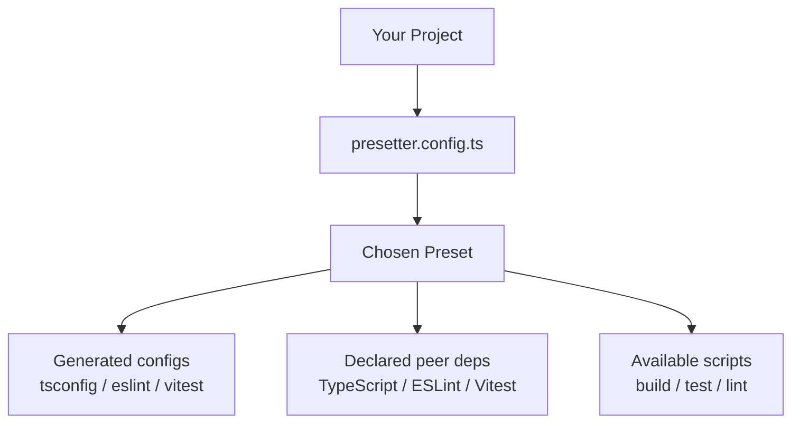

# Core Concepts

Understand the fundamental concepts that make Presetter powerful and flexible.

## The Big Picture

Presetter solves a common problem: **configuration fatigue**. Instead of copying build configs across projects or maintaining dozens of development dependencies, Presetter lets you define configurations once and reuse them everywhere.


```mermaid
graph TD
    A[Your Project] --> B[presetter.config.ts]
    B --> C[Chosen Preset]
    C --> D["Generated configs<br/>tsconfig / eslint / vitest"]
    C --> E["Declared peer deps<br/>TypeScript / ESLint / Vitest"]
    C --> F["Available scripts<br/>build / test / lint"]
```

## Core Components

### 1. Presets

A **preset** is a reusable bundle of:
- 📦 **Dependencies**: Tools like TypeScript, ESLint, Vitest
- 📄 **Configuration files**: tsconfig.json, eslint.config.ts, etc.
- 📜 **Scripts**: build, test, lint commands
- 🎨 **Assets**: Templates with variable substitution

```typescript
// A preset exports a configuration object
import { preset } from 'presetter';

export default preset('my-preset', {
  variables: { /* context data */ },
  scripts: { /* npm scripts */ },
  assets: { /* config files */ },
  override: { /* customizations */ }
});
```

### 2. Assets

**Assets** are configuration files that get generated in your project. They support:

- **Static content**: Direct JSON/text content
- **Variable substitution**: Dynamic values from context
- **Function generation**: Programmatic config creation
- **Deep merging**: Combining multiple config sources

```typescript
// Example asset definitions
assets: {
  // Static JSON content
  'tsconfig.json': {
    compilerOptions: {
      target: 'ES2020',
      module: 'ESNext'
    }
  },
  
  // Array content (for .gitignore, etc.)
  '.gitignore': [
    'node_modules',
    'dist',
    '*.log'
  ],
  
  // Function-generated content
  'vite.config.ts': (current, { variables }) => ({
    ...current,
    root: variables.source
  })
}
```

### 3. Variables

**Variables** provide context to your configurations. They're available throughout the preset system:

```typescript
variables: {
  source: 'src',        // Source directory
  output: 'dist',       // Output directory
  target: 'ES2020',     // TypeScript target
  node: process.version // Dynamic values
}
```

Use variables in assets:
```typescript
'tsconfig.json': {
  compilerOptions: {
    outDir: '{output}',      // Becomes: "dist"
    rootDir: '{source}'      // Becomes: "src"
  }
}
```

### 4. Scripts

**Scripts** define npm/pnpm/yarn commands available in your project:

```typescript
scripts: {
  build: 'tsc',
  test: 'vitest',
  lint: 'eslint {source}/**/*.ts',
  'test:watch': 'vitest --watch'
}
```

Presetter merges preset scripts with your local package.json scripts, with local scripts taking priority.

### 5. Context

The **context** object provides information about your project environment:

```typescript
interface ProjectContext {
  isRepoRoot: boolean;
  relativeProjectRoot: string;
  relativeRepoRoot: string;
  repoRoot: string;
  projectRoot: string;
  packageJson: PackageJson;
}
```

Use context for dynamic presets:
```typescript
import { preset } from 'presetter';

export default preset('smart-preset', (context) => {
  const isReactProject = context.packageJson.dependencies?.react;
  
  return {
    assets: {
      'eslint.config.ts': isReactProject 
        ? reactEslintConfig 
        : standardEslintConfig
    }
  };
});
```

## Key Principles

### 🔄 Configuration Inheritance

Presets can extend other presets, creating inheritance chains:

```typescript
import { preset } from 'presetter';

// Base preset
const base = preset('base', {
  scripts: { build: 'tsc' },
  assets: { 'tsconfig.json': { /* ... */ } }
});

// Extended preset
const react = preset('react', {
  extends: [base],
  scripts: { start: 'react-scripts start' },
  assets: { 'tsconfig.json': { /* React-specific additions */ } }
});
```

### 🎯 Override System

The **override** field lets you customize inherited configurations:

```typescript
import { preset } from 'presetter';

export default preset('my-project', {
  extends: [basePreset],
  override: {
    variables: {
      source: 'lib'  // Override default 'src'
    },
    assets: {
      'eslint.config.ts': (current) => ({
        ...current,
        rules: {
          ...current.rules,
          'no-console': 'error'  // Add custom rule
        }
      })
    }
  }
});
```

### 🚀 Dependency Management

Official presets declare their required tools as **peer dependencies**. npm 7+ installs those peers when you install the preset; pnpm and yarn users should follow their package manager's peer-dependency behavior:

```json
// Your package.json stays minimal
{
  "devDependencies": {
    "presetter": "^8.3.0",
    "@presetter/preset-esm": "^8.3.0"
  }
}

// The preset declares peer tools such as:
// typescript, eslint, vitest, prettier, etc.
```

### 🔗 Generated File Strategy

Bootstrap writes generated configuration files into your project:

- Re-run `presetter bootstrap` after changing preset versions or local overrides.
- Keep durable customizations in `presetter.config.ts` instead of editing generated output.
- Generated files can be ignored when your workflow prefers regenerating them from the preset stack.

## Advanced Concepts

### Conditional Configuration

Make configurations responsive to project context:

```typescript
import { preset } from 'presetter';

export default preset('adaptive', (context) => {
  const isMonorepo = context.packageJson.workspaces !== undefined;
  const hasReact = context.packageJson.dependencies?.react;
  
  return {
    assets: {
      'tsconfig.json': {
        compilerOptions: {
          composite: isMonorepo,  // Enable for monorepos
          jsx: hasReact ? 'react-jsx' : undefined
        }
      }
    }
  };
});
```

### Asset Templating

Use advanced templating for complex configurations:

```typescript
assets: {
  'vite.config.ts': `
import { defineConfig } from 'vite';

export default defineConfig({
  root: '{source}',
  build: {
    outDir: '../{output}'
  },
  test: {
    globals: true
  }
});
  `.trim()
}
```

### Multi-Preset Composition

Combine multiple specialized presets:

```typescript
import { preset } from 'presetter';
import esm from '@presetter/preset-esm';
import react from '@presetter/preset-react';
import strict from '@presetter/preset-strict';

export default preset('full-stack', {
  extends: [esm, react, strict],
  // Each preset contributes its part
});
```

## Next Steps

Now that you understand the concepts:

- 🛠️ **Configure your setup**: [Configuration Guide](./configuration)
- 📚 **Explore presets**: [Preset Ecosystem](/docs/presets)
- 🎨 **Create custom presets**: [Tutorials](/docs/tutorials)
- 🔍 **See comparisons**: [Presetter vs Others](./comparison)
