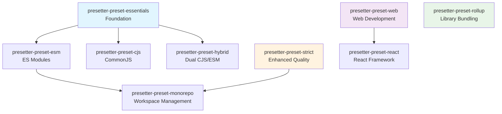

# Presetter Preset Ecosystem

Presets are the heart of Presetter—carefully crafted bundles of configurations, dependencies, and scripts designed for specific use cases. The ecosystem is organized in a hierarchical structure that promotes composition and reusability.

## Preset Hierarchy



## Quick Preset Selection

### 🎯 By Project Type

| Project Type | Recommended Preset | Additional Options |
|--------------|-------------------|-------|
| **Modern TypeScript App** | `presetter-preset-esm` | + `strict` for quality |
| **NPM Library** | `presetter-preset-hybrid` | + `rollup` for bundling |
| **React Application** | `presetter-preset-react` | Includes web tools |
| **Legacy Node.js** | `presetter-preset-cjs` | + `strict` for quality |
| **Monorepo** | `presetter-preset-monorepo` | Includes ESM + strict |
| **Web Frontend** | `presetter-preset-web` | TailwindCSS + Storybook |

### 📦 By Module System

- **ES Modules only**: [`presetter-preset-esm`](./module-systems/esm)
- **CommonJS only**: [`presetter-preset-cjs`](./module-systems/cjs) 
- **Dual compatibility**: [`presetter-preset-hybrid`](./module-systems/hybrid)

### 🔧 By Use Case

- **Quick start**: [`presetter-preset-essentials`](./foundation/essentials)
- **Production-ready**: `essentials` + [`presetter-preset-strict`](./quality/strict)
- **Library publishing**: [`presetter-preset-rollup`](./bundling/rollup)
- **Team consistency**: [`presetter-preset-monorepo`](./quality/monorepo)

## Preset Categories

### 🏗️ [Foundation](./foundation)

Core development tools and essential configurations that serve as the base for all other presets.

- **[essentials](./foundation/essentials)** - TypeScript, ESLint, Vitest, Prettier, and essential tooling

### 📁 [Module Systems](./module-systems)

Specialized configurations for different JavaScript module formats and compatibility requirements.

- **[esm](./module-systems/esm)** - Modern ES Modules configuration
- **[cjs](./module-systems/cjs)** - CommonJS module configuration  
- **[hybrid](./module-systems/hybrid)** - Dual CommonJS/ESM package delivery

### 🎨 [Frameworks](./frameworks)

Framework-specific configurations that include specialized tooling and optimizations.

- **[web](./frameworks/web)** - Web development with PostCSS, TailwindCSS, and Storybook
- **[react](./frameworks/react)** - React applications with TSX support and React-specific linting

### 📦 [Bundling](./bundling)

Advanced bundling and build configurations for library and application distribution.

- **[rollup](./bundling/rollup)** - Rollup bundler with comprehensive plugin ecosystem

### ✨ [Quality](./quality)

Enhanced code quality, project structure, and team collaboration tools.

- **[strict](./quality/strict)** - Additional linting rules and quality enforcement
- **[monorepo](./quality/monorepo)** - Monorepo workspace management and optimization

## Preset Composition

### Single Preset Usage

```typescript
// presetter.config.ts
export { default } from 'presetter-preset-esm';
```

### Multiple Preset Composition

```typescript
// presetter.config.ts
import { preset } from 'presetter-types';
import esm from 'presetter-preset-esm';
import strict from 'presetter-preset-strict';

export default preset('my-project', {
  extends: [esm, strict],
  // Custom overrides here
});
```

### Advanced Composition

```typescript
// presetter.config.ts
import { preset } from 'presetter-types';
import essentials from 'presetter-preset-essentials';
import strict from 'presetter-preset-strict';
import rollup from 'presetter-preset-rollup';

export default preset('production-library', {
  extends: [essentials, strict, rollup],
  variables: {
    target: 'ES2020',
    output: 'dist'
  },
  override: {
    assets: {
      'package.json': {
        type: 'module',
        exports: {
          '.': {
            import: './dist/index.js',
            require: './dist/index.cjs'
          }
        }
      }
    }
  }
});
```

## Preset Comparison Matrix

| Feature | essentials | esm | cjs | hybrid | strict | web | react | rollup | monorepo |
|---------|-----------|-----|-----|--------|--------|-----|-------|--------|----------|
| **TypeScript** | ✅ | ✅ | ✅ | ✅ | ✅ | ❌ | ✅ | ✅ | ✅ |
| **ESLint** | ✅ | ✅ | ✅ | ✅ | ✅ | ❌ | ✅ | ✅ | ✅ |
| **Vitest** | ✅ | ✅ | ✅ | ✅ | ✅ | ❌ | ✅ | ✅ | ✅ |
| **Prettier** | ✅ | ✅ | ✅ | ✅ | ✅ | ❌ | ✅ | ✅ | ✅ |
| **Module Type** | Any | ESM | CJS | Both | Any | - | ESM | Both | ESM |
| **React Support** | ❌ | ❌ | ❌ | ❌ | ❌ | ❌ | ✅ | ❌ | ❌ |
| **Bundling** | ❌ | ❌ | ❌ | ❌ | ❌ | ❌ | ❌ | ✅ | ❌ |
| **Strict Rules** | ❌ | ❌ | ❌ | ❌ | ✅ | ❌ | ❌ | ❌ | ✅ |
| **Storybook** | ❌ | ❌ | ❌ | ❌ | ❌ | ✅ | ✅ | ❌ | ❌ |
| **TailwindCSS** | ❌ | ❌ | ❌ | ❌ | ❌ | ✅ | ✅ | ❌ | ❌ |
| **Monorepo Tools** | ❌ | ❌ | ❌ | ❌ | ❌ | ❌ | ❌ | ❌ | ✅ |

## Common Configuration Variables

All presets (except standalone ones) support these configurable variables:

```typescript
variables: {
  source: 'src',          // Source directory
  output: 'lib',          // Build output directory  
  test: 'spec',           // Test directory
  types: 'types',         // Type definitions directory
  target: 'ES2022'        // TypeScript compilation target
}
```

## Migration Between Presets

### From Basic to Strict

```typescript
// Before
export { default } from 'presetter-preset-esm';

// After
import { preset } from 'presetter-types';
import esm from 'presetter-preset-esm';
import strict from 'presetter-preset-strict';

export default preset('strict-project', {
  extends: [esm, strict]
});
```

### From Single to Monorepo

```typescript
// Individual package preset
export { default } from 'presetter-preset-esm';

// Monorepo root preset
export { default } from 'presetter-preset-monorepo';
```

### Adding Framework Support

```typescript
// Before (basic TypeScript)
export { default } from 'presetter-preset-esm';

// After (React application)
import { preset } from 'presetter-types';
import esm from 'presetter-preset-esm';
import react from 'presetter-preset-react';

export default preset('react-app', {
  extends: [esm, react]
});
```

## Getting Help

If you're unsure which preset to choose:

1. **Start simple**: Begin with `presetter-preset-essentials` or `presetter-preset-esm`
2. **Add incrementally**: Add more presets as your needs grow
3. **Check examples**: Look at the detailed preset documentation
4. **Ask the community**: [GitHub Discussions](https://github.com/alvis/presetter/discussions)

## Next Steps

- **[Foundation Presets](./foundation)** - Start with the core essentials
- **[Module System Presets](./module-systems)** - Choose your module format
- **[Framework Presets](./frameworks)** - Add framework-specific tools
- **[Quality Presets](./quality)** - Enhance code quality and collaboration