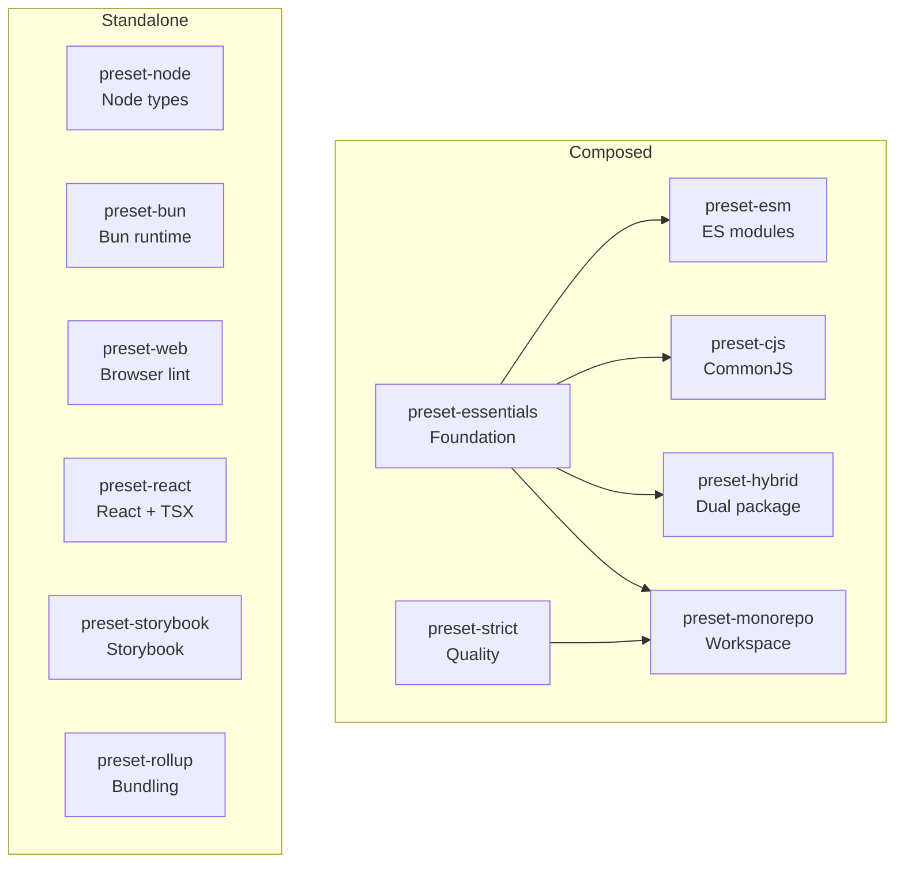

# Presetter Preset Ecosystem

Presets are the heart of Presetter—carefully crafted bundles of configurations, dependencies, and scripts designed for specific use cases. The ecosystem is organized in a hierarchical structure that promotes composition and reusability.

## Preset Hierarchy


```mermaid
graph TB
    subgraph composed["Composed"]
      A["preset-essentials<br/>Foundation"] --> B["preset-esm<br/>ES modules"]
      A --> C["preset-cjs<br/>CommonJS"]
      A --> D["preset-hybrid<br/>Dual package"]
      A --> F["preset-monorepo<br/>Workspace"]
      E["preset-strict<br/>Quality"] --> F
    end

    subgraph standalone["Standalone"]
      N["preset-node<br/>Node types"]
      U["preset-bun<br/>Bun runtime"]
      G["preset-web<br/>Browser lint"]
      H["preset-react<br/>React + TSX"]
      S["preset-storybook<br/>Storybook"]
      I["preset-rollup<br/>Bundling"]
    end
```

## Quick Preset Selection

### 🎯 By Project Type

| Project Type | Recommended Preset | Additional Options |
|--------------|-------------------|-------|
| **Modern TypeScript App** | `@presetter/preset-esm` | + `strict` for quality |
| **NPM Library** | `@presetter/preset-hybrid` | + `rollup` for bundling |
| **React Application** | `@presetter/preset-react` | Add `web` for browser globals |
| **Node.js Service or CLI** | `@presetter/preset-node` | + `esm` + `strict` |
| **Bun Service or CLI** | `@presetter/preset-bun` | Standalone (no essentials) |
| **Legacy Node.js** | `@presetter/preset-cjs` | + `strict` for quality |
| **Monorepo** | `@presetter/preset-monorepo` | Includes essentials + strict |
| **Web Frontend** | `@presetter/preset-web` | Browser globals + TailwindCSS linting |

### 📦 By Module System

- **ES Modules only**: [`@presetter/preset-esm`](./module-systems/esm)
- **CommonJS only**: [`@presetter/preset-cjs`](./module-systems/cjs) 
- **Dual compatibility**: [`@presetter/preset-hybrid`](./module-systems/hybrid)

### 🔧 By Use Case

- **Quick start**: [`@presetter/preset-essentials`](./foundation/essentials)
- **Production-ready**: `essentials` + [`@presetter/preset-strict`](./quality/strict)
- **Library publishing**: [`@presetter/preset-rollup`](./bundling/rollup)
- **Team consistency**: [`@presetter/preset-monorepo`](./quality/monorepo)

## Preset Categories

### 🏗️ [Foundation](./foundation)

Core development tools and essential configurations that serve as the base for all other presets.

- **[essentials](./foundation/essentials)** - TypeScript, ESLint, Vitest, Prettier, and essential tooling

### 🏃 [Runtimes](./runtimes)

Runtime-targeted presets that shape the TypeScript and build story for a specific JavaScript runtime.

- **[@presetter/preset-node](./runtimes/node)** - Standalone Node-tuned `tsconfig.json` override
- **[@presetter/preset-bun](./runtimes/bun)** - Standalone Bun preset with `bun build` scripts and Bun ambient types

### 📁 [Module Systems](./module-systems)

Specialized configurations for different JavaScript module formats and compatibility requirements.

- **[esm](./module-systems/esm)** - Modern ES Modules configuration
- **[cjs](./module-systems/cjs)** - CommonJS module configuration  
- **[hybrid](./module-systems/hybrid)** - Dual CommonJS/ESM package delivery

### 🎨 [Frameworks](./frameworks)

Framework-specific configurations that include specialized tooling and optimizations.

- **[web](./frameworks/web)** - Browser globals, DOM typings, TailwindCSS linting, and static asset typings
- **[react](./frameworks/react)** - React applications with TSX support and React-specific linting
- **[storybook](./frameworks/storybook)** - Standalone Storybook setup with a11y checks and Vitest browser testing

### 📦 [Bundling](./bundling)

Advanced bundling and build configurations for library and application distribution.

- **[rollup](./bundling/rollup)** - Rollup bundler with comprehensive plugin ecosystem

### ✨ [Quality](./quality)

Enhanced code quality, project structure, and team collaboration tools.

- **[strict](./quality/strict)** - Additional linting rules and quality enforcement
- **[monorepo](./quality/monorepo)** - Monorepo workspace management and optimization

## Preset Composition

### Single Preset Usage

```typescript
// presetter.config.ts
export { default } from '@presetter/preset-esm';
```

### Multiple Preset Composition

```typescript
// presetter.config.ts
import { preset } from 'presetter';
import esm from '@presetter/preset-esm';
import strict from '@presetter/preset-strict';

export default preset('my-project', {
  extends: [esm, strict],
  // Custom overrides here
});
```

### Advanced Composition

```typescript
// presetter.config.ts
import { preset } from 'presetter';
import essentials from '@presetter/preset-essentials';
import strict from '@presetter/preset-strict';
import rollup from '@presetter/preset-rollup';

export default preset('production-library', {
  extends: [essentials, strict, rollup],
  variables: {
    target: 'ES2020',
    output: 'dist'
  },
  override: {
    assets: {
      'package.json': {
        type: 'module',
        exports: {
          '.': {
            import: './dist/index.js',
            require: './dist/index.cjs'
          }
        }
      }
    }
  }
});
```

### Runtime-Targeted Composition

```typescript
// Node backend + ESM + strict
import { preset } from 'presetter';
import node from '@presetter/preset-node';
import esm from '@presetter/preset-esm';
import strict from '@presetter/preset-strict';

export default preset('my-node-api', {
  extends: [node, esm, strict],
});
```

```typescript
// Standalone Bun service — no essentials, no extra presets required
export { default } from '@presetter/preset-bun';
```

## Preset Comparison Matrix

| Feature | essentials | node | bun | esm | cjs | hybrid | strict | web | react | storybook | rollup | monorepo |
|---------|-----------|------|-----|-----|-----|--------|--------|-----|-------|-----------|--------|----------|
| **TypeScript** | ✅ | ✅ | ✅ | ✅ | ✅ | ✅ | ✅ | ❌ | ✅ | ❌ | ✅ | ✅ |
| **ESLint** | ✅ | ❌ | ❌ | ✅ | ✅ | ✅ | ✅ | ❌ | ✅ | ✅ | ✅ | ✅ |
| **Vitest** | ✅ | ❌ | ❌ | ✅ | ✅ | ✅ | ✅ | ❌ | ✅ | ✅ | ✅ | ✅ |
| **Prettier** | ✅ | ❌ | ❌ | ✅ | ✅ | ✅ | ✅ | ❌ | ✅ | ❌ | ✅ | ✅ |
| **Module Type** | Any | Any | ESM | ESM | CJS | Both | Any | - | ESM | - | Both | ESM |
| **Extends essentials** | - | ❌ | ❌ | ✅ | ✅ | ✅ | ❌ | ❌ | ❌ | ❌ | ❌ | ✅ |
| **Runtime Types** | - | node | bun | - | - | - | - | - | - | - | - | - |
| **Bun Build Scripts** | ❌ | ❌ | ✅ | ❌ | ❌ | ❌ | ❌ | ❌ | ❌ | ❌ | ❌ | ❌ |
| **React Support** | ❌ | ❌ | ❌ | ❌ | ❌ | ❌ | ❌ | ❌ | ✅ | ❌ | ❌ | ❌ |
| **Bundling** | ❌ | ❌ | ✅ | ❌ | ❌ | ❌ | ❌ | ❌ | ❌ | ❌ | ✅ | ❌ |
| **Strict Rules** | ❌ | ❌ | ❌ | ❌ | ❌ | ❌ | ✅ | ❌ | ❌ | ❌ | ❌ | ✅ |
| **Storybook** | ❌ | ❌ | ❌ | ❌ | ❌ | ❌ | ❌ | ❌ | ❌ | ✅ | ❌ | ❌ |
| **TailwindCSS** | ❌ | ❌ | ❌ | ❌ | ❌ | ❌ | ❌ | ✅ | ❌ | ❌ | ❌ | ❌ |
| **Monorepo Tools** | ❌ | ❌ | ❌ | ❌ | ❌ | ❌ | ❌ | ❌ | ❌ | ❌ | ❌ | ✅ |

## Common Configuration Variables

All presets (except standalone ones) support these configurable variables:

```typescript
variables: {
  source: 'src',          // Source directory
  output: 'lib',          // Build output directory  
  test: 'spec',           // Test directory
  types: 'types',         // Type definitions directory
  target: 'ES2024'        // TypeScript compilation target (default)
}
```

## Migration Between Presets

### From Basic to Strict

```typescript
// Before
export { default } from '@presetter/preset-esm';

// After
import { preset } from 'presetter';
import esm from '@presetter/preset-esm';
import strict from '@presetter/preset-strict';

export default preset('strict-project', {
  extends: [esm, strict]
});
```

### From Single to Monorepo

```typescript
// Individual package preset
export { default } from '@presetter/preset-esm';

// Monorepo root preset
export { default } from '@presetter/preset-monorepo';
```

### Adding Framework Support

```typescript
// Before (basic TypeScript)
export { default } from '@presetter/preset-esm';

// After (React application)
import { preset } from 'presetter';
import esm from '@presetter/preset-esm';
import react from '@presetter/preset-react';

export default preset('react-app', {
  extends: [esm, react]
});
```

## Getting Help

If you're unsure which preset to choose:

1. **Start simple**: Begin with `@presetter/preset-essentials` or `@presetter/preset-esm`
2. **Add incrementally**: Add more presets as your needs grow
3. **Check examples**: Look at the detailed preset documentation
4. **Ask the community**: [GitHub Discussions](https://github.com/alvis/presetter/discussions)

## Next Steps

- **[Foundation Presets](./foundation)** - Start with the core essentials
- **[Runtime Presets](./runtimes)** - Target Node.js or Bun
- **[Module System Presets](./module-systems)** - Choose your module format
- **[Framework Presets](./frameworks)** - Add framework-specific tools
- **[Quality Presets](./quality)** - Enhance code quality and collaboration
